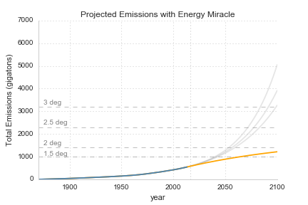

## Intro
I know that climate change is a serious problem.  I know that my lifestyle makes it worse.  And I know I should change those behaviors that make my carbon footprint unjustifiably high. But I don't.  Besides buying wind power once during a stint in a past apartment, I haven't done anything else meaningful to reduce my carbon liabilities.

Reflecting on this made me wonder why.  Was it because the changes would be too hard or costly?  Was it because I didn't know what to change or that the change wouldn't matter?  Though I haven't figured it all out, what became clear after a bit of thinking was that even though I "know" a lot (I've read plenty of articles on the subject) I was still ignorant of basic facts relevant to changing my behavior.

I didn't know, for example, what the consensus was for allowable warming, or how much carbon we could collectively emit to stay under that target.  I didn't know what my personal carbon quota should be or where my current footprint was in relation to it.  And I didn't know the best actions to take to get within my quota.  What follows is a report of what I found attempting to answer those questions.

## Part 1: The Problem
First, a bit of background to motivate things.

[Global atmospheric temperature affects _many_ physical systems critical to human (and animal and ecosystem) well-being](https://www.ipcc.ch/pdf/assessment-report/ar4/wg2/ar4_wg2_full_report.pdf).  This includes: levels and melting rates of snow, ice, and frozen ground, affecting not only sea levels but also glacial runoff, ocean salinity, and habitat for many species; terrestrial biological systems such as the timing of spring related events (leaf unfolding, animal migration), the size and location of plant and animal habitat; marine and freshwater biological systems, like the ranges and volumes of algal, plankton and fish abundance, ranges and migration times of fish and other species; precipitation levels, storm formation and intensity, drought and desertification, flooding, plant productivity, forest fires, dry season length and many more. [todo: citations and links]

The concentration of atmospheric "greenhouses" gasses is a primary driver of temperature change.  These gasses (primarily carbon dioxide, but also methane, nitrous oxide, and ozone, and others) trap energy from the sun that would otherwise be radiated back into space as infrared light, warming the air and raising atmospheric temperature (average air temperature at surface level, specifically).  Scientists studing this relationship estimate that every 1,000 kilograms, or metric ton, of CO2 leads to an approximately 0.0000000000015 degree increase in temperature [TODO: CITATION].

This might not seem like much, but the important take away is that there's a straightforward and well-understood relationship between the amount of carbon in the atmosphere and the global temperature and well-understood relationships between global temperature and critical physical systems.

Over geological time the amount of atmospheric carbon has fluctuated (due volcanic eruptions, the expansion and contraction of forests, and similar natural events), but within the last 800,000 years has stayed between about 400 and 600 gigatons. [todo: change back to ppm]

Since industrialization, however, the concentration of these gases has shot up, increasing 29% in the last 140 years alone, leading to an estimated 1 degree of warming since 1880[2].  The [International Panel on Climate Change (IPCC)](http://www.ipcc.ch/), the U.N. sanctioned body for assessing the science related to climate change has confirmed that the release of greenhouse gases due to human activities is the primary driver of the recent temperature increase, with 95% certainty [CITATION].

If carbon emissions grow at historic rates, scientists estaimate a roughly 3.6 degree temperature increase by the year 2100, which would have catestrophic implications for communities and ecosystems throughout the world.

[todo: extrapolate trend to 2100]

  Among (many) other things, the IPCC estimates that such a level of warming would lead to: extinction of up to or exceeding 40% of the worlds plant and animal species, widespread coral mortality, significant shifts in species' range, hundreds of millions of people exposed to increased water stress, a doubling in frequency of the strongest Atlantic cyclones, loss of about 30% of global coastal wetland, millions exposed to coastal flooding, significant increase in insect-born diseases due to expanded ranges, widespread crop failure, a 50% increase in extreme drought in the US and Southern Asia, a 20% rise in the likelihood of potentially lethal daytime tmperatures in the United States and China, as well as the risk of significant future increases in temperature due to the release of hundreds of gigatons of carbon and carbon equivalents currently stored in permafrost throughout Siberia and the poles [CITATION].

## Part 2: Target Emissions and Warming
### What goal should be set for warming and carbon emissions?

If the consensus is that 3.6 degrees is an intollerable level of warming, what level can we tolerate?  In December 2015, representatives from 196 countries met in Paris for the UN Conference on Climate Change to come to consensus on that number and offer commitments to making the reductions necessary to cap warming at that level.  The agreement reached ultimately included a goal of keeping warming "well below" 2 degrees C inluded a target of 1.5 degrees of warming by 2100 with a 50% chance of success [TODO: CITATION].

Why 1.5 degrees?  Above 1.5 degrees  climate impacts, like heat extremes, crop yield reductions in tropical regions, subtropical water scarcity, widespread bleaching of coral reefs, and sea-rise of up to 1 meter go from being "somewhat likely" to being "very likely".  "The additional 0.5 ◦C increase in global-mean temperature marks the difference between events at the upper limit of present-day natural variability and a new climate regime, particularly in tropical regions." [CITATION]

ADD FACTS ABOUT IMPACTS OF 1.5 DEGREES

[Degree by Degree explanation of what will happen when the earth warms](http://globalwarming.berrens.nl/globalwarming.htm)

[1.5 degree key facts](http://climateanalytics.org/hot-topics/1-5c-key-facts.html)

A 1.5 degree target means we have a collective, all-time carbon "budget" of about about 1,000 gigatons or 1 trillion metric tons of anthropogenic carbon and carbon equivalent emissions.  [todo: show and reference warming per gigaton chart]. To date, we've released about 500 gigatons [TODO: CITATION], meaning we have about 500 gt to emit over the next 34 years.  Given current emisisons and emission growth rates, we're on track to exhaust that budget within the next four to 20 years.

## Part 3: How can we get there?
To stay within our budget we have to shrink our emissions by an 2% per year (on average) for the next 34 years to get to zero net new emissions by 2050.  [todo: citation].  We have roughly four options for doing this:

1. reduce demand for energy
2. increase energy efficiency
3. reduce carbon output per unit of energy
4. increase the amount of C02 removed from the atmosphere

Barring catastrophe, global population is expected to grow to [11 billion people](http://www.un.org/en/development/desa/news/population/2015-report.html) by 2100.  In the next 25 years [nearly a billion are expected to join the middle class](http://siteresources.worldbank.org/EXTABCDE/Resources/7455676-1292528456380/7626791-1303141641402/7878676-1306699356046/Parallel-Sesssion-6-Homi-Kharas.pdf), and they'll want the services that come with that status.  So in general demand for energy will grow over the next decades. [todo: add energy projection chart]

There are reductions in services -- especially in those serivces consumed by the top of the global income distribution -- however, that can have a meaningful impact.  [The average American takes 6.8 flights per year](https://www.ustravel.org/answersheet).  Reducing that by just **one** flight could take 5% off that his or her carbon footprint.  Apartments and condos use [50% less energy](http://buildingsdatabook.eren.doe.gov/docs/DataBooks/2011_BEDB.pdf) than single-family homes. Residential energy use accounts for 10% of all carbon emmissions.  If we were to become a completely urban civilization, we'd reduce emissions that much further.  And it's  estimated that [22.6kgs of C02-equivalent gasses are emitted for each 1kg of beef](http://www.unep.org/pdf/unep-geas_oct_2012.pdf).  Were we to cut out beef from our diets we'd reduce emissions by 5% (livestock accounts for nearly half of agricultural emissions which are 14% of total emissions, mostly in the form of [methane emissions from cow digestion](https://en.wikipedia.org/wiki/Enteric_fermentation)).

Spread over the next 34 years, these reductions combined would bring down the emissions rate by .5% per year (a big improvement!).  Unfortunately, that's not enough to get to the 2% necessary to stay within our budget.
 
Beyond consuming less we can also make the services we consume more energy efficient.  We can increase vehicle transportation efficiency through more efficient fuels, higher fuel economy standards, and [automation](http://energy.gov/sites/prod/files/2015/11/f27/QTR2015-8A-Connected-Automated-Vehicles.pdf) of the transportation fleet.  Together these could yeild up to a 40% reduction in vehicle emisisons recucing overall emisisons 4%.  We can also exploit advances in [construction](http://www.rmi.org/RFGraph-US_buildings_energy_saving_potential) techniques, efficiency improvements in appliances and [lighting](https://www.sciencedaily.com/releases/2013/10/131031090435.htm), and [automation](http://spectrum.ieee.org/energywise/energy/environment/-is-energy-efficiency-the-most-popular-in-home-automation) of temperature control.  Combined these lead to a 5% overall reduction.  And advances in manufacturing and industrial processes could yield another 3% reduction.

Combined, these efficinecy gains would yield another .4% annual reduction. This would be another huge, but insufficient step.  We'll also need to reduce the amount of carbon emitted generating the energy for these services.

Which brings us to zero carbon energy sources: solar, wind, biomass, nuclear, and carbon capture.  A recent [UBS analysis](http://reneweconomy.com.au/2015/ubs-analysts-solar-will-become-the-default-technology-of-the-future-19986) indicates that solar could account for nearly 50% of electricity production by 2050, and [according to the IAEA](http://www.renewableenergyworld.com/articles/2015/02/wind-energy-outlook-2015-could-total-installed-wind-capacity-reach-2000-gw-by-2030.html) wind could account for nearly 30%.  Nuclear energy currently [accounts for nearly 11%](http://www.nei.org/Knowledge-Center/Nuclear-Statistics/World-Statistics) of global electricity production and that could [increase to 20% by 2050](https://www.oecd-nea.org/ndd/reports/2010/nea6962-nuclear-roadmap.pdf).

Deploying these technologies as widely as possible would do the most towards getting us to our goal, yielding a nearly 1.5% annual reduction in emissions.  Unfortunately, even with this full suite we'd still be on track to exceded 1.5 degrees, and we'd still be growing our emissions (though less quickly and eventually leveling off around 2 degrees C).

To get us "well below 2 degrees" and within our carbon budget we'll need to do one last thing: increase the amount of carbon we're removing from the atmosphere.  The primary global system for doing this extraction is forests.  Unfortunately, we're decimating them, which means they're taking out less and less carbon each year.  This change, called 'land use change' accounts for fully 18% of carbon emissions each year.  Halting that reduction and protecting and reforesting could save us a full .5% per year.  That, combined with the other reductions would put us at just about 1 trillion tons emitted by the end of the century, with zero net additional emissions.

In summary, to stay within our carbon budget we need to: reduce our home sizes, air travel, and meat consumption; agressively push efficiency improvements in transportation, construction, and manufacturing; create and deploy a viable a zero carbon "enery miracle"; and agressively reduce deforestation.  And we need to do this in the next 30 years.

## Part 4: Where do I fit in?
Addressing climate change so difficult because _no_ no person, company, or even country is individually responsible for the problem or can individually fix it.  The solution will only come from lots of people supporting a range of actions.  So what are those actions and which can I, as a individual take?

To start, I'm not going to become a politician, or energy entreprenuer, or full-time climate activist.  Climate change solutions will only happen if people choose those paths, but I'm not going to be one of them.  So what should I do?  Well, in short I can reduce my own carbon footrpint, support the work of the above-mentioned groups, and try to get others to do the same.

The most direct way of personally reducing atmospheric carbon is reducing the amount I'm responsible for: reducing my carbon footprint.  So what is my carbon footprint?  After gathering data about my transportation footprint, home electricity usage, and my share of the US government's carbon responsibility over the last three years it's at least 15 tons per year.  (I say at least because this doesn't include the so-called "embedded" carbon from what I purchase or that of the energy used by my work.)

To get a sense of how high that is, if the rest of humanity had the same footprint we'd see roughly 6 degrees of warming (the global average is about 5.3 tons).  For us to stay within our overall quota, per capita emissions need to shrink to 2 tons per year (for the next 34 years and going to zero after that).  

 

What can I do to get my footprint to 2 tons?  The short answer is: stop flying.  If I were able to do that my carbon footprint would drop by __87%__.  Flights make up so much of my footprint, if I were to take just two fewer flights per year I'd reduce my footprint by 20% more than taking away all other non-flight carbon sources (carbon from driving, home electricity, etc.) _combined_.

In 2017 I'm going to try to take one less trip per year, but it'll be difficult to get that number under 8 total flights.  As mentioned, all other sources of carbon make up roughly 2 tons.  Since I don't own a car, live in a small apartment, and don't eat beef, there aren't a lot of other useful cuts I can make.

To make up the difference, I'm donating $100 a month to [Cool Earth](https://www.coolearth.org/) a UK-based non-profit that works with indigenous communities to preserve rain forest, which according to [Giving What We Can's estimates](https://www.givingwhatwecan.org/report/cool-earth/), would capture 898 tons (!) of C02 equivalent emissions (assuming I donate every month).

Though that reduction is big on an individual basis, it's not completely generalizable.  Even if we were to "save the rain forest" that would only cover 18% of our emissions.  The other 72% is going to come from efficiency improvements and zero-carbon energy sources (predominantly the latter).  These changes, however, will only come policy changes that increase the cost of carbon and incentivize zero-carbon innovation.  There are a number of both bills and regulatory actions currently being pursued by the federal government that could use our support (or our opposition).  These include [a large number of bills](http://www.c2es.org/federal/congress/114/climate-change-legislative-proposals) and standards like [Carbon Standards for New, Modified and Reconstructed Powerplants](https://www.epa.gov/cleanpowerplan/carbon-pollution-standards-new-modified-and-reconstructed-power-plants), and the [Clean Power Plan](https://www.epa.gov/cleanpowerplan).  Coordinating this kind of action is difficult, so I'm also donating to the [Citizen's Climate Lobby](https://citizensclimatelobby.org/), a grassroots advocacy organization focused on national carbon pricing policies.

### Encouraging Others to do the same
 - Encourage others to do the same

### Aftwerward: Is this the best way for me to spend my time and money?
Meeting my personal carbon quota is important, but it's not my only moral obligation.  Donating time and resources to other charities and causes, doing my civic dutiy in other respects, and so on have competing claims on my time and resources.

 - [Determining the Cost-Effectiveness of Climate Change Interventions](https://www.givingwhatwecan.org/report/modelling-climate-change-cost-effectiveness/)

### References
1. Schaefer, Kevin et al. "The impact of the permafrost carbon feedback on global climate." Environmental Research Letters 9.8 (2014): 085003
2. "Chapter Climate Change 2014 Synthesis Report … - IPCC." 2015. 12 Jan. 2016 https://www.ipcc.ch/pdf/assessment-report/ar5/syr/AR5_SYR_FINAL_SPM.pdf
3. GISTEMP Team, 2016: GISS Surface Temperature Analysis (GISTEMP). NASA Goddard Institute for Space Studies. Dataset accessed 20YY-MM-DD at http://data.giss.nasa.gov/gistemp/.

### General Resources
 - [How much action does climate change warrant - Harvard EA](http://www.harvardea.org/blog/2015/9/12/how-much-attention-does-climate-change-warrant)
 - [Sharing what's left of the pie just got easier](http://roadtoparis.info/2014/12/05/sharing-whats-left-carbon-emissions-pie-just-got-little-easier/)
 - [Giving What We Can Climat Change Report](https://www.givingwhatwecan.org/cause/climate-change/)
 - [Ice Cores and Climate Change](https://www.bas.ac.uk/data/our-data/publication/ice-cores-and-climate-change/)
 - [NOAA Paleo Climatology Ice Cores Data Sets](https://www.ncdc.noaa.gov/cdo/f?p=517:1:0:::APP:PROXYDATASETLIST:7)
 - [Effective Altruism Is Exploring Climate Change Action, and You Can Be Part of It](http://effective-altruism.com/ea/wk/effective_altruism_is_exploring_climate_change/)
 -  [The Trillion-ton Cap](http://e360.yale.edu/feature/the_trillion-ton_cap_allocating_the_worlds_carbon_emissions/2703/)
 - [Sharing What's Left of the Carbon Pie Just Got Easier](http://roadtoparis.info/2014/12/05/sharing-whats-left-carbon-emissions-pie-just-got-little-easier/)
 - [NOAA Global Surface Temperature Anomolies](http://www.ncdc.noaa.gov/monitoring-references/faq/anomalies.php)
 - [Scientists discuss the 1.5C limit to global temperature rise](https://www.carbonbrief.org/scientists-discuss-the-1-5c-limit-to-global-temperature-rise)
 - [CO2 emissions by country 1970-2013](http://edgar.jrc.ec.europa.eu/overview.php?v=CO2ts1990-2013)
- [Federal carbon footprint](http://www.environmentalleader.com/2011/05/02/fed-carbon-footprint-121-3-million-metric-tons-lion%E2%80%99s-share-is-dod/)
- [Environmental Life Style Analysis](http://web.mit.edu/ebm/www/Publications/ELSA%20IEEE%202008.pdf)
- [Wired review of MIT ELSA paper](http://www.wired.com/2008/04/mit-class-calcu/)
- [How Climate Change is Rapidly Taking the World Apart](http://www.flassbeck-economics.com/how-climate-change-is-rapidly-taking-the-planet-apart/)
- [Carbon Dioxide Informational Analysis Center](http://cdiac.ornl.gov/GCP/)
- [McKinsey US energy savings: opportunities and challenges](http://www.mckinsey.com/industries/electric-power-and-natural-gas/our-insights/us-energy-savings-opportunities-and-challenges)
- [Airline carbon footpring](http://www.atag.org/facts-and-figures.html)
- [World greenhouse emissions by sector](http://www.grida.no/graphicslib/detail/world-greenhouse-gas-emissions-by-sector_6658#)
- [US Energy Savings: Opportunities and challenges](http://www.mckinsey.com/industries/electric-power-and-natural-gas/our-insights/us-energy-savings-opportunities-and-challenges)
- [US Travel answer sheet](https://www.ustravel.org/answersheet)
- [Green house gas emmissions from meat production](http://www.unep.org/pdf/unep-geas_oct_2012.pdf)
- [World beef and cattle statistics](http://beef2live.com/story-world-beef-cattle-statistics-0-108033)
- [World greenhouse gas emissions by sector](http://www.grida.no/graphicslib/detail/world-greenhouse-gas-emissions-by-sector_6658#)
- [Effects of carbon tax on the economy and the environment](https://www.cbo.gov/sites/default/files/113th-congress-2013-2014/reports/Carbon_One-Column.pdf)
- [Greenhouse gas emissions by sector](http://www.grida.no/graphicslib/detail/world-greenhouse-gas-emissions-by-sector_6658#)
- [Global emissions by sector](https://www.epa.gov/ghgemissions/global-greenhouse-gas-emissions-data#Sector)
- [Buildings Energy Data Book](http://buildingsdatabook.eren.doe.gov/docs/DataBooks/2011_BEDB.pdf)
- [UBS Solar Report](http://reneweconomy.com.au/2015/ubs-analysts-solar-will-become-the-default-technology-of-the-future-19986)
- [Nuclear Energy Association Technology Report](https://www.oecd-nea.org/ndd/reports/2010/nea6962-nuclear-roadmap.pdf)
- [Nuclear Energy Institute Technology World Statistics](http://www.nei.org/Knowledge-Center/Nuclear-Statistics/World-Statistics)
- [Trends in Global C02 Emissions 2013 Report](http://edgar.jrc.ec.europa.eu/news_docs/pbl-2013-trends-in-global-co2-emissions-2013-report-1148.pdf)
- [World Carbon Dioxide Emissions, 1980-2006](https://docs.google.com/spreadsheets/d/1yduvmpwSneAZPP8KM5JLkEiuKH9EyOuwxH4eWTb1Bh4/edit#gid=2)

### Notes
  - [1ppm C02 = 7.76GtC02](https://onlineconversion.vbulletin.net/forum/main-forums/convert-and-calculate/11072-convert-gtco2-to-ppm-rise-in-atmosphere)
  - [2.08 GtonC/ppm](http://www.atmos.washington.edu/2002Q4/211/notes_humancarbon.html)

### Jetsam / Use for other stuff
Each, however, faces major hurdles to implementation and adoption.  Wind and solar are intermittent sources, meaning power generation is decoupled from demand and location.  We'll need new ways of storing and transporting that energy over long distances or temporal periods to see the gains.  Significant advances in battery and other storage technoloy are needed to overcome these challenges.  Nuclear is a proven and implemented option, but still faces issues with proliferation concerns and waste storage.  And lastly carbon capture would allowing us to keep most of our existing energy infrastructure.  Unfortunately how to store all the waste, whose volumes are orders of magnitude greater than any other waste source, is a major challenge. (Liqifying the balance of our carbon budget would yield a pool of carbon waste roughly 1/3 the volume of Lake Ontario).

Zero-carbon solutions, even if created, will face challenges of adoption if carbon-based energy is still significantly cheaper. [todo: add why, add facts]  This is where carbon pricing comes in.  By setting an overall cap on emissions and then charging for carbon emitted beyond that level emitters are financially incentivized to reduce their overall levels and switch to renewable options.

