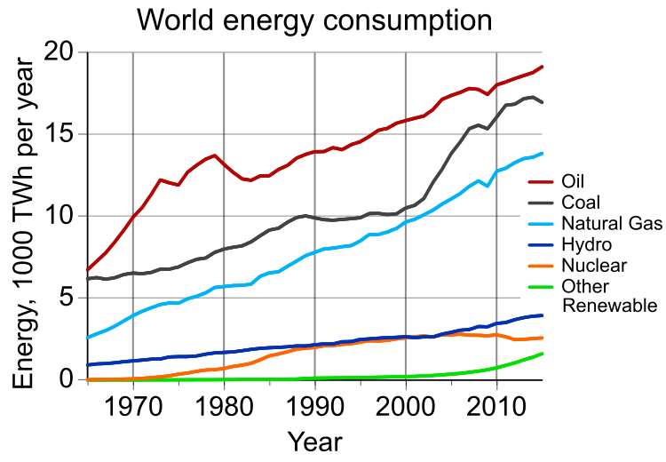

## Intro
I know that climate change is a serious problem.  I know that my lifestyle makes it worse.  And I know I should change those behaviors that make my carbon footprint unjustifiably high. But I don't.  Besides buying wind power once during a stint in a past apartment, I haven't done anything else meaningful to reduce my carbon liabilities.

Reflecting on this made me wonder why.  Was it because the changes would be too hard or costly?  Was it because I didn't know what to change or that the change wouldn't matter?  Though I haven't figured it all out, what became clear after a bit of thinking was that even though I "know" a lot (I've read plenty of articles on the subject) I was still ignorant of basic facts relevant to changing my behavior.

I didn't know, for example, what the consensus was for allowable warming, or how much carbon we could collectively emit to stay under that target.  I didn't know what my personal carbon quota should be or where my current footprint was in relation to it.  And I didn't know the best actions to take to get within my quota.  What follows is a report of what I found attempting to answer those questions.

## Part 1: The Problem
First, a bit of background to motivate things.

[Global atmospheric temperature affects _many_ physical systems critical to human (and animal and enviornmental) well-being](https://www.ipcc.ch/pdf/assessment-report/ar4/wg2/ar4_wg2_full_report.pdf).  This includes: levels and melting rates of snow, ice, and frozen ground, affecting not only sea levels but also glacial runoff, ocean salinity, and habitat for many species; terrestrial biological systems such as the timing of spring related events (leaf unfolding, animal migration), the size and location of plant and animal habitat; marine and freshwater biological systems, like the ranges and volumes of algal, plankton and fish abundance, ranges and migration times of fish and other species; precipitation levels, storm formation and intensity, drought and desertification, flooding, plant productivity, forest fires, dry season length and many more. [TODO: ADD CITATIONS AND LINKS]

The concentration of atmospheric "greenhouses" gasses is a primary driver of temperature change.  These gasses (primarily carbon dioxide, but also methane, nitrous oxide, and ozone, and others) trap energy from the sun that would otherwise be radiated back into space as infrared light, warming the air and raising average atmospheric temperature (when talking about warming, scientists use mean surface air temperatre, which is what I'll use from here on).  Scientists studing this relationship estimate that every 1,000 kilograms, or metric ton, of CO2 leads to an approximately 0.0000000000015 degree increase in temperature [TODO: CITATION].  This might not seem like very much, and in some respects it's not, but the important thing to take away is that there's a straightforward and well-understood relationship between the amount of carbon in the atmosphere and the global temperature and well-understood relationships between global temperature and critical physical systems. 

Over geological time the amount of atmospheric carbon has fluctuated (due to events like volcanic eruptions, the expansion and contraction of forests, etc), but within the last 800,000 years has stayed between about 400 and 600 gigatons.

Since industrialization, however, the concentration of these gases has increased 29% over pre-industrial levels, leading to an estimated 1 degree of warming since 1880[2].  The [International Panel on Climate Change (IPCC)](http://www.ipcc.ch/), the U.N. sanctioned body for assessing the science related to climate change has confirmed that the release of greenhouse gases due to human activities is the primary driver of the recent temperature increase, with 95% certainty [CITATION].

 
If carbon emissions grow at historic rates, scientists estaimate a roughly 3.6 degree temperature increase by the year 2100, which would have catestrophic implications for many countries, communities, and ecosystems throughout the world.

  The IPCC estimates, for example, that such a level of warming would lead to (among many other things): extinction of up to or exceeding 40% of the worlds plant and animal species, widespread coral mortality, significant shifts in species' range, hundreds of millions of people exposed to increased water stress, a doubling in frequency of the strongest Atlantic cyclones, loss of about 30% of global coastal wetland, millions exposed to coastal flooding, significant increase in insect-born diseases due to expanded ranges, widespread crop failure, a 50% increase in extreme drought in the US and Souther Asia, a 20% rise in the likelihood of potentially lethal daytime tmperatures in the United States and China, as well as the risk of significant future increases in temperature due to the release of hundreds of gigatons of carbon and carbon equivalents currently stored in permafrost throughout Siberia and the poles [CITATION].

## Part 2: Target Emissions and Warming
### What goal should be set for warming and carbon emissions?

If the overwhelming consensus is that 3.6 degrees is an intollerable level of warming, what level can we tolerate?  In December 2015, representatives from 196 countries met in Paris for the UN Conference on Climate Change to come to a consensus around that and offer commitments to the emissions reductions necessary to cap warming at that level (with reasonable confidence).  The agreement reached ultimately included a goal of keeping warming "well below" 2 degrees C inluded a target of 1.5 degrees of warming by 2100 with a 50% chance of success [TODO: CITATION].

The scientific community, however, already had an answer to that question: 1.5 degrees C above pre-industrial temperature.  Above 1.5 degrees  climate impacts, like heat extremes, crop yield reductions in torpical regions, subtropical water scarcity, widespread bleaching of coral reefs, and sea-rise of up to 1 meter go from being "somewhat likely" to being "very likely".  "The additional 0.5 ◦C increase in global-mean temperature marks the difference between
events at the upper limit of present-day natural variability and a new climate regime, particularly in tropical regions." [CITATION]

ADD FACTS ABOUT IMPACTS OF 1.5 DEGREES

[Degree by Degree explanation of what will happen when the earth warms](http://globalwarming.berrens.nl/globalwarming.htm)

[1.5 degree key facts](http://climateanalytics.org/hot-topics/1-5c-key-facts.html)

A 1.5 degree target means we have a collective, all-time carbon "budget" of about about 1,000 gigatons or 1 trillion metric tons of anthropogenic carbon and carbon equivalent emissions (man-made emissions on top of naturally occuring carbon).  To date, we've released nearly 500 gigatons [TODO: CITATION], meaning we have about 500 gt to emit over the next 34 years.  Given current emisisons and emission growth rates, we're on track to exhaust that budget within the next four to 20 years.

## Part 3: How are we going to get there?
 - We need to reduce the amount of carbon output by __X__ perecent per year

### Options for addressing climate change
Given that we're on track to exhuast our buget so quickly, the name of the game is doin the following as agressively as possible: __reducing the amount of new carbon we put into the atmosphere__ and __increasing the amount we take out__.  Since 2010 Bill Gates has been using the following useful formula for exploring how we can reduce emissions in the amount necessary 

$$ CO_2 = Population * Services / person * Energy/service * CO_2/unit $$

Reductions in emissions will come from reducing demand for energy from cabon-based sources, which means either reducing the overall amount of energy demanded or increasing the proportion of energy non-carbon emitting sources (beyond the growth of carbon-prodcing sources).  Unfortunately, aside the periods of significant recession, global energy demand has steadily increased year-over-year and will likely continue to do so.  

That said, there is significant room for efficiency improvements.  In 2012 Lawrence Livermore Labs estimated that roughly 60% of the energy generated in the United States was [wasted](https://flowcharts.llnl.gov/content/assets/images/energy/us/Energy_US_2015.png) meaning that there is significant room for reducing emissions without sacrificing economic output.  Moreover, many of the items we use every day, from applicances to airplane engines, to windows operate highly inefficiently.  Increasing the efficiency of these itmes is another way to reduce demand without reducing output.  [TOD: ADD MORE FACTS ABOUT POTENTIAL FOR EFFICIENCY GAINS]

The alternative to reductions is accelerating the shift to carbon-free energy.  One side of that shift is making carbon-based energy more expensive.  Carbon taxes or credits are the prime policy option here.  By setting an overall cap on emissions and then charging for carbon emitted beyond that level emitters are financially incentivized to reduce their overall levels.  The [European Union's Emissons Trading System](http://ec.europa.eu/clima/policies/ets/index_en.htm) is the largest example of such a system.  Though very important, such systems are difficult to implement as they reqluire all of the parties within a large geographical region (many states within a country or countries) to buy into the system for them to work, and they mean pure cost for all of the constituents within those regions, making them politically difficult to implement.  

The other side of the shift is lowering the cost and increasing the availability of carbon-free energy.  These sources like solar, wind, biomass, geothermal, and tidal offer the benefit of providing energy without any carbon, but each has drawbacks and major hurdles to implementation.  Solar and wind challenges: generation is decoupled from demand and location, meaning we need ways of storing and transporting that energy over long distances or temporal periods.

Though reductions are necessary to keep us within our global budget, it's unlikely we'll be able to cut enough to curb emissions in time.  We will also need to be increasing the amout of carbon we're taking out of the atmsphere.  The first way of doing that is by stopping the ways in which we're currently reducing the natural mechanisms for taking carbon out of the air: deforestation.  Every year __X__ acres of forest are logged and clear-cut, reducing the the amount of carbon taken out of the atmosphere by __X__ tons.  

The last and possibly greatest hope for meeting our overall carbon target is the large-scale removal of carbon from the atmosphere through techincal means.  This process, ofter called geoengineering consists of filter, baloons, fans, and other traps for carbon that capture, liquify and and then store the carbon outside of the atmosphere.  That last bit is the tricky part though.  The volumes of carbon we're talking about storing are on the billions of tons. If we overshot our limit by less than amount projected under the status quo, that would mean filling up a volume the size of Lake Ontario.  Though tha's not impossible (there's a lot more of other liquids under ground) it creates a significant engineering challenge.

### Who is going to make these things happen?
How to divide up the remaining carbon (that is, how to distribute the responsibilities for redcution) is an incredibly difficult political question that raise significant issues of fairness, history, need, and ability to contributes.

Developing countries have argued that division rules (and accompanying reductions) insensitive to their development needs would unduly harm their abilities to improve the lives of their citizens.  Why, they arue, should their people be deprived of basic improvements in well-being so that otherwise perfectly well-off westerners can indulge their high-consumption lifestyles?  Developed countries have for the majority of their histories developed without restriction on emissions.  Expecting developing countries to develop under harsh restrictions constitutes a double standard.  Developed countries should take responsibility for their high-carbon paths to development and take on the majority of reductions.

Developed countries on the other hand cite practical considerations for adopting a "grandfathered" or "inertial" rules of division, which would use each countries current emissions as the starting point from which to make reductions.  The reductions required by an equal share or "equity" approach would be so drastic that they'd require economic and legal changes that have no chance of being adopted by the democratic governments of those countries.  They argue instead for gradual but accelerating reductions that allow of economic, political, and technological adaptations to reduction.

"Top down" approaches to reduction commitments (where rules are adopted for redcutions through international agreement, as in the Kyoto Protocol) have stagnated though due to the disagreements outlined above.  No country wants to be the "sucker" that pays the cost of contributing to collective action while others "free ride" on those contributions).  More recently, as in the Paris COP, a "bottom up" approach has been taken, where individual or groups of countries make commitments that they think are fair.  The hope is that gradual individual movements will allow for an eventual convergence to global reductions adequate to meet 1.5 degrees warming overall target.

With the "bottom up", approach the focus shifts from internaltional agreements on individual country quotas, to consistency about local behaviors - i.e. "if others acted in accordance with a country's proposed share of the quota, would the outcome be acceptable?"

## Part 4: Where do I fit in?
So where do I fit in?  Well, climate change is an archetypal collective action problem, one that emerges out of the behavior of governments, yes, but also corporations (and other organizations) and also individual people as well.  What makes them so difficult is that _no_ individual actor, government, company, or individual contributes enough be responsible for the problem.  Yes, governments themselves are responsible for significant emissions, but most of the proposals for addressing climate change at that level are about the things governments are going to force those at lower levels (comapnies and people) to do.  But there doesn't seem to be anything in principle that means behavior change should only happen at the governmental level.  I don't see why I shouldn't apply the same "what would the world be like" rule to myself and my own life and behavior.  So what should my proposed personal carbon quota be, and would the world be like if others adopted that policy?

### What should my carbon quota be?
The primary arguments against equity focus on the practical impediments to adopting steep reductions and on the burdens they would impose on the countries with the highest current emmissions.  Compelling as those arguments might be from an international treaty-making perspctive, they doesn't address the _truth_ of the proposition that we're each only entitled to an equal share of global carbon quota.  It may be the case that the difference between my personal quota and current lifestyle would require reductions that are (even very) difficult, but unlike a large democratic country, I'm a well-off individual with significant abilities to change lifestyle and adapt (regardless of how unpleasant those changes might be).

Dividing the quota up over the next 36 years, and then dividing that by the projected population at each year gives the following yearly quotas up to 2050.

[TODO: DETAIL SOME OTHER DIVISION RULES BESIDES EQUITY]

### Where am I in relation to that quota?
Where am I currently in relation to that roughly 2000kg per year goal?  What is my current carbon responsibility?  Unfortunately, computing an accurate personal carbon footprint is difficult and burdensome.  The areas of one's life and activities that generate carbon liabilities are numerous, diverse, and difficult to track.  Generally, they're bucketed into four categories:

 1. Transportation-related carbon, including plane trips, car trips, use of public transportation
 2. Housing-related carbon, from heating, cooling, & electricity
 3. "Embedded" carbon, or the carbon that's emitted in the process of producing and transporting goods one consumes
 4. Other liabilities, like my share of the US Govenernment's carbon footprint.

Fortunately, technologies and new institutional data sources are facilitating the tracking of quotidian behaviors and new models are being used to compute the carbon footprints of these behaviors. Below are charts that use [Moves](https://www.moves-app.com/) and [Con Edision Green Button](http://www.greenbuttondata.org/) energy data along with carbon calcualtions from the [Brighter Planet API](http://impact.brighterplanet.com/documentation) to compute my personal carbon footprint for transportation and housing over the last two years.

As the above chart indicates, my carbon footprint is pretty high.  For each of the two years with full data, my footprint from transportation alone exceeded 13,000 kgs of carbon, meaning I was 650% above my quota each year.  Going back to the principle of consistent behavior, if everyone in the world had a similar footprint we'd likely see closet to 6 degrees of warming, an amount that could imperil humanity itself. 

### What can I do to get within my quota?
So what can I do to reduce my footprint and get within the amount I'm entitled to?  The natural place is to reduce the amount of carbon I'm responsible for through behavior and lifestyle changes.  A big start would be reducing the number of flights I take per year.  Plane flights dominate all other modes of transportation and for me are responsible for 10 times as much carbon as the next highest mode, cars.

I average about 8 [CHECK THIS NUMBER] flights a year, and with each flight's carbon averaging my entire quota, that's going to be hard for me to elminate.  That said, even marginal reductions would have a signficant impact on my behavior

[TODO: LIST OUT OTHER BEHAVIORAL OPTIONS, LIKE CHANGING PURCHASING BEHAVIOR | TODO: ADD INFORMATION ABOUT GOV'T QUOTA]

After behavioral changes, my options are offsets and advocacy for policy change.  (Scientists and policy-makers also disucss technical solutions, like geoengineering and carbon capture and sequestration, but I can only lobby for those things, not do them myself).

[TODO: ONLY INTRODUCE OFFSETS HERE]

An alternative to taking costly personal actions (like not flying) is paying else to do something that cuts emissions.  Carbon offsets do exactly this. These "something elses" include activities like reforestation (forests act as a carbon sink, reducing total atmospheric carbon), investments in renewable energy projects (like wind or solar), or destruction of industrial pollutants.  Offsets have the benefit of allowing individuals (and insititutions) the ability to reduce their carbon responsibilities without having to make drastic changes to lifestyle.

They aren't without drawbacks though.  Accounting for exaclty how much carbon is being reduced by a given project is a challenge.  It can take years, for example, for a reforestation project to begin pulling carbon out of the air in significant quantities, and there's no gaurantee about how long those trees will stay there.  Offsets can also create perverse incentives for polluters.  A manufacturing company for example, generated 500 million dollars in offests for equipment to destroy industiral pollutants that only cost 5 million dollars to implement.  They later went on to produce more polluting factories just to get the offsets.

[Giving What We Can](http://preview.givingwhatwecan.org/report/2CFCCfUSi4icqeS6emE046) has identified [Cool Earth](https://www.coolearth.org/) as a highly effective organization to donate to for carbon reduction and Charity Navigator has given the [Carbon Fund](https://carbonfund.org/) its [highest rating](https://www.charitynavigator.org/index.cfm?bay=search.summary&orgid=12315).

[TODO: GIVE MORE DETAILS ABOUT MY DECISION-MAKING AROUND OFFSETS]

Another option is supporting the advocacy for national policies that would address climate change on a much larger scale.  Though riskiker, this approach has the potential to have much more impact than any individual contribution.  Organizations like the [Citizen's Climate Lobby](https://citizensclimatelobby.org/) (also highly regarded by [Giving What We Can](https://www.givingwhatwecan.org/charity/ccl/)) advocate for a [carbon fee and dividend](http://citizensclimatelobby.org/carbon-fee-and-dividend/) policy to reduce greenhouse gas emission by 52% over 1990 levels.

[TODO: ADD OTHER LOBBYING OPTIONS]

### Aftwerward: Is this the best way for me to spend my time and money?
Meeting my personal carbon quota is important, but it's not my only moral obligation.  Donating time and resources to other charities and causes, doing my civic dutiy in other respects, and so on have competing claims on my time and resources.  

 - [Determining the Cost-Effectiveness of Climate Change Interventions](https://www.givingwhatwecan.org/report/modelling-climate-change-cost-effectiveness/)

### References
1. Schaefer, Kevin et al. "The impact of the permafrost carbon feedback on global climate." Environmental Research Letters 9.8 (2014): 085003
2. "Chapter Climate Change 2014 Synthesis Report … - IPCC." 2015. 12 Jan. 2016 https://www.ipcc.ch/pdf/assessment-report/ar5/syr/AR5_SYR_FINAL_SPM.pdf 
3. GISTEMP Team, 2016: GISS Surface Temperature Analysis (GISTEMP). NASA Goddard Institute for Space Studies. Dataset accessed 20YY-MM-DD at http://data.giss.nasa.gov/gistemp/.

### General Resources
 - [How much action does climate change warrant - Harvard EA](http://www.harvardea.org/blog/2015/9/12/how-much-attention-does-climate-change-warrant)
 - [Sharing what's left of the pie just got easier](http://roadtoparis.info/2014/12/05/sharing-whats-left-carbon-emissions-pie-just-got-little-easier/)
 - [Giving What We Can Climat Change Report](https://www.givingwhatwecan.org/cause/climate-change/)
 - [Ice Cores and Climate Change](https://www.bas.ac.uk/data/our-data/publication/ice-cores-and-climate-change/)
 - [NOAA Paleo Climatology Ice Cores Data Sets](https://www.ncdc.noaa.gov/cdo/f?p=517:1:0:::APP:PROXYDATASETLIST:7)
 - [Effective Altruism Is Exploring Climate Change Action, and You Can Be Part of It](http://effective-altruism.com/ea/wk/effective_altruism_is_exploring_climate_change/)
 -  [The Trillion-ton Cap](http://e360.yale.edu/feature/the_trillion-ton_cap_allocating_the_worlds_carbon_emissions/2703/)
 - [Sharing What's Left of the Carbon Pie Just Got Easier](http://roadtoparis.info/2014/12/05/sharing-whats-left-carbon-emissions-pie-just-got-little-easier/)
 - [NOAA Global Surface Temperature Anomolies](http://www.ncdc.noaa.gov/monitoring-references/faq/anomalies.php)
 - [Scientists discuss the 1.5C limit to global temperature rise](https://www.carbonbrief.org/scientists-discuss-the-1-5c-limit-to-global-temperature-rise)
 - [CO2 emissions by country 1970-2013](http://edgar.jrc.ec.europa.eu/overview.php?v=CO2ts1990-2013)
- [Federal carbon footprint](http://www.environmentalleader.com/2011/05/02/fed-carbon-footprint-121-3-million-metric-tons-lion%E2%80%99s-share-is-dod/)
- [Environmental Life Style Analysis](http://web.mit.edu/ebm/www/Publications/ELSA%20IEEE%202008.pdf)
- [Wired review of MIT ELSA paper](http://www.wired.com/2008/04/mit-class-calcu/)
- [How Climate Change is Rapidly Taking the World Apart](http://www.flassbeck-economics.com/how-climate-change-is-rapidly-taking-the-planet-apart/)

 ### Notes
  - [1ppm C02 = 7.76GtC02](https://onlineconversion.vbulletin.net/forum/main-forums/convert-and-calculate/11072-convert-gtco2-to-ppm-rise-in-atmosphere)
  - [2.08 GtonC/ppm](http://www.atmos.washington.edu/2002Q4/211/notes_humancarbon.html)
   

