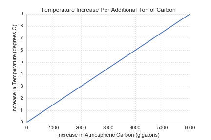
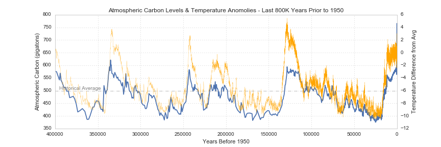
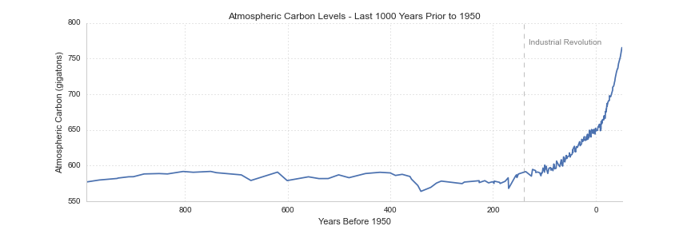

TODO:

 - **DONE** research & draft temperature-sensitive physical systems
 - **DONE** identify amount of carbon released since industrialization and find source
 - **DONE** get data of historical carbon levels
 - **DONE** research consequences of the "business-as-usual" pathway
 - find some basic facts about the Paris COP
 - find references / citations for economic policy re: climate change (stern report?)
 - research justification for the 1.5 degree warming increase
 - find citation for total emissions to date
 - find relationship between ppm and temperature change
 - get detailed atmospheric carbon data from 1950 onward
 - get mean surface temperature dataset
 - research and outline the competing rationales for various carbon proposals
 - get con ed green button power data
 - draft section on setting personal climate goal
 - research outstanding personal carbon liabilities
 - add references
 - citations! (for degree / ton temperature number, others)

## The Problem
The dyanimcs of many physical systems critical to human (and animal and enviornmental) well-being are [strongly influenced by global temperature](https://www.ipcc.ch/pdf/assessment-report/ar4/wg2/ar4_wg2_full_report.pdf).
  This includes (but if far from limited to): levels and melting rates of snow, ice (glaciers, polar ice caps, etc.), and frozen ground, affecting not only sea levels, but also glaicial runoff, ocean salinity, and habitat for many species; terrestrial biological systems such as the timing of spring related events (leaf unfolding, animal migration), the size and location of plant and animal habitat; marine and freshwater biological systems, like the ranges and volumes of algal, plankton and fish abundance, ranges and migration times of fish and other species; precipitation levels, storm formation and intensity, drought and desertification, flooding, plant productivity, forest fires, dry season length. [CITATION]
  

Though surface temperature is dependent on multiple factors [CITATION / FOOTNOTES], a primay driver of changes is the concentration of "greenhouses" gasses in the atmosphere.  These gasses (including carbon, methane, [TODO: ADD OTHERS]) trap energy from the sun that would otherwise be radiated back into the atmosphere as ultraviolet light, warming the air and raising average atmospheric temperature [CITATION].  Scientists studing this relationship estimate that every metric ton of CO2 leads to an approximately 0.0000000000015 increase in mean surface temperature [CITATION].

Over geological time the amount of atmospheric carbon has fluctuated in a roughly cyclical pattern (due to volcanic eruptions, etc), but has been relatviely stable arount 200 ppm for the last 10,000 years.  

Since industrialization, however, the concentration of these gases has increased __X__ percent, leading to an estimated __X__ degrees of warming.  The International Panel on Climate Change has confirmed that the release of greenhouse gases due to human activities is the primary driver of the recent temperature increase, with 95% certainty [CITATION].

 
If carbon emissions grow at historic rates, scientists estaimate a roughly 3.5 degree temperature increase by the year 2100, which have __catestrophic__ implications for many countries, communities, and ecosystems throughout the world.  The IPCC estimates, for example, that such a level of warmin would lead to (among many other things): extinction of up to or exceeding 40% of the worlds plant and animal species, widespread coral mortality, significant shifts in species' range, hundreds of millions of people exposed to increased water stress, a doubling in frequency of the strongest Atlantic cyclones, loss of about 30% of global coastal wetland, millions exposed to coastal flooding, significant increase in insect-born diseases due to expanded ranges, widespread crop failure, a 50% increase in extreme drought in the US and Souther Asia, a 20% rise in the likelihood of potentially lethal daytime tmperatures in the United States and China, as well as the risk of significant future increases in temperature due to the release of hundreds of gigatons of carbon and carbon equivalents currently stored in permafrost throughout Siberia and the poles [CITATION].

## Target Emission Levels
### What goal should be set for warming and carbon emissions?
 Given the stability and flourishing over the last 10,000 years, presumably the ideal would be to have no warming [is this the case?].  Unfortunately, as carbon is cumulative and long-lasting (it stays in the atmosphere for approximately 1000 years) [CITATION], we'd need to average emissions of negative 5 billion tons per year for the next 84 (with zero emissions thereafter) to "undo" historical emissions and get to zero.

Since this isn't currently feasible, the question is to what extent can emissions be reduced without doing more social and economic harm than we would avert [CITATION: ECONOMIC POLICY MAKING AROUND CLIMATE CHANGE].
Ultimately, the choice of the extent of reduction depends on the how the costs associated with various degrees of warming are evaluated - be they evaluated by economic cost, cost to human health, cost to plants and animals, to future generations, etc.

In December 2015, representatives from around the world [TODO: who were they, how many countries, which countries, etc.] met in Paris, at the so-called "Convening of the Parties" (a meeting held under the auspices of the U.N.) to set a global warming target and make commitments to emissions reductions necessary to achieve that goal.  The parties ultimately set a target of 1.5 degrees of warming by 2100 [TODO: add how they selected that number][TODO: CITATION].  Emissions beyond that number, they concluded, made the likelihood of catestrophic warming too great [TODO: enumerate reasons why].

1.5 degree target means we have a global, all-time carbon "budget" of about about 1,000 gigatons or 1 trillion metric tons of carbon and carbon equivalent emissions.  To date, we've released nearly 500 gigatons [TODO: CITATION], meaning we have approximately 500 gt to emit over the next 84 years.  Given current emisisons and emission growth rates, we're on track to exhaust our budget by __YEAR Y__, meaning we'd need a cumulative reduction in emissions by __X__ percent each year.

### Who is going to make those reductions?
- Who is going to make those reducitons and how they'll be made are incredibly difficult political questions.  The question of how to divide the remaining the 500 gigatons raises significant questions of fairness, history, and ability to contributes.
- what's the division rule?
 - divide based on today's emissions?
 - equally divide the remaining budget amongst all currently living people?
 - divide based on where goods are consumed that require carbon?
 - divide based on the ability to handle / pay for the reductions?
 - divide based on history?
- start of attribution: when do you start carbon to different nations?  1750? 1970? Today?.  Many argue that developed nations shoudld take responsibility for their high-cabon bath to industrialization over the 19th and 20th centuries.    
- Should the remaining 500 gigatons be distributed equally amongst countries?  Why not the the 1000 gigatons of total allowable emmissions?  If the latter, developed countries, like the US, UK, China, etc, will have already used most of their slice [TODO: CITATION].
- Developing countries argue that significant reductions would do disproportionate harm to them, and that their historical emmissions pale in comparison to that of developed countries.
- Or should some different criterion be used, like equity or inertia?  Should ability to pay, development needs, or current emmissions levels be used to set targets.  A new proposal has been floated called ‘contraction and convergence’, in which overall global emissions contract to a safe level while all countries steadily converge on a common per capita emissions level.
 
### Resources
 - [The Trillion-ton Cap](http://e360.yale.edu/feature/the_trillion-ton_cap_allocating_the_worlds_carbon_emissions/2703/)
 - [Sharing What's Left of the Carbon Pie Just Got Easier](http://roadtoparis.info/2014/12/05/sharing-whats-left-carbon-emissions-pie-just-got-little-easier/)

## My Contribution
- As one who believes in the rationale for a 1.5 degree temperature goal and wants to be "part of the solution" rather than a perpetuator of the problem, this raises the question: what do I need to do to be part of the solution?  This question, unfortunately, is not an easy one and just raises others:
  - What should my carbon quota be?
  - Where am I in currently relation to that goal?
  - What options are available to reach that goal?

### What should my carbon quota be?
The arguments against equity, or the equal share of emissions for each person are primarily focus on the burdens to reduce it would impose on the countries with the highest current emmissions.  That practical argument, however, doesn't bare on the _truth_ of the position.

 - Competing approaches
  - equality
  - equity
  - inertia

### Where am I in relation to that goal?
- Personal carbon footprint are generally composed of:
 - Transportation
 - Housing (heating/cooling, electricity)
 - Embedded carbon from consumption
 - Other carbon responsibilities (i.e. my share of the US Govenernment's carbon footprint)

- as you can see from the above chart, for the two years with full data, my footprint from transportation alone exceded 12,000 kgms

### What can I do to get there
- Reductions
 - Reducing flights
 - Reducing cab rides
 - Replacing subway trips with bike rides
 - Replacing short car rides with bike rides
- Offests
 - [Cool Earth](https://www.coolearth.org/)
 - [Cool Earth Giving What We Can Report](http://preview.givingwhatwecan.org/report/2CFCCfUSi4icqeS6emE046)
 - [Carbon Fund](https://carbonfund.org/)
 - [New York Residential Green Energy](http://www.conedsolutions.com/GoGreen/Residential/NewYork_Green_Residential.aspx)
- Lobbying for National Policies
 - Carbon taxes / pricing
 - [Citizen's Climate Lobby GWWC Report](https://www.givingwhatwecan.org/charity/ccl/)
- Geoengineering
 - Carbon capture and sequestration

### Aftwerward: Is this the best way for me to spend my time and money? 
 - [Determining the Cost-Effectiveness of Climate Change Interventions](https://www.givingwhatwecan.org/report/modelling-climate-change-cost-effectiveness/)

### References
- Schaefer, Kevin et al. "The impact of the permafrost carbon feedback on global climate." Environmental Research Letters 9.8 (2014): 085003

### General Resources
 - [How much action does climate change warrant - Harvard EA](http://www.harvardea.org/blog/2015/9/12/how-much-attention-does-climate-change-warrant)
 - [Sharing what's left of the pie just got easier](http://roadtoparis.info/2014/12/05/sharing-whats-left-carbon-emissions-pie-just-got-little-easier/)
 - [Giving What We Can Climat Change Report](https://www.givingwhatwecan.org/cause/climate-change/)
 - [Ice Cores and Climate Change](https://www.bas.ac.uk/data/our-data/publication/ice-cores-and-climate-change/)
 - [NOAA Paleo Climatology Ice Cores Data Sets](https://www.ncdc.noaa.gov/cdo/f?p=517:1:0:::APP:PROXYDATASETLIST:7)
 - [Effective Altruism Is Exploring Climate Change Action, and You Can Be Part of It](http://effective-altruism.com/ea/wk/effective_altruism_is_exploring_climate_change/)
   

