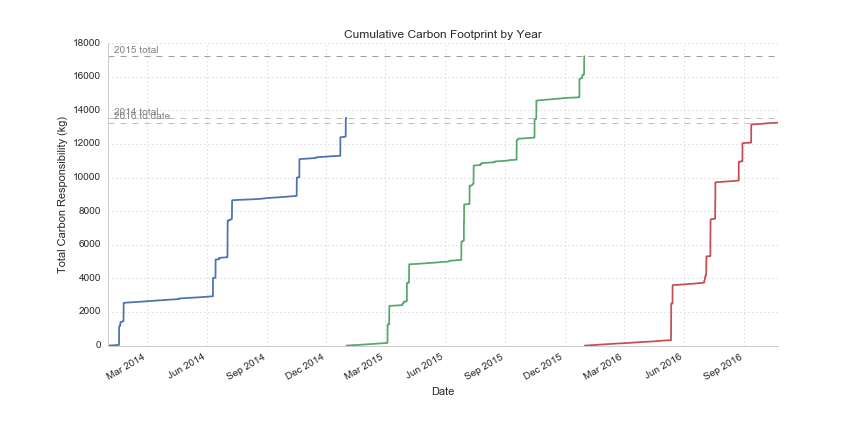

TODO:

 - research & draft temperature-sensitive physical systems
 - **DONE** identify amount of carbon released since industrialization and find source
 - **DONE** get data of historical carbon levels
 - research consequences of the "business-as-usual" pathway
 - find some basic facts about the Paris COP
 - find references / citations for economic policy re: climate change (stern report?)
 - research justification for the 1.5 degree warming increase
 - find citation for total emissions to date
 - find relationship between ppm and temperature change
 - get detailed atmospheric carbon data from 1950 onward
 - get mean surface temperature dataset
 - research and outline the competing rationales for various carbon proposals
 - get con ed green button power data
 - draft section on setting personal climate goal
 - research outstanding personal carbon liabilities
 - add references
 - citations! (for degree / ton temperature number, others)

## The Problem
 - The dyanimcs of many physical systems critical to human (and animal and enviornmental) well-being are strongly influenced by global temperature.  
  - sea ice levels influence the jet stream, the movement of salt in the oceans
  - rainfall levels across the planet - influencing crop yields, arable land
  - disease transmission
  - food supply
  - storm intensity
  - heat and habitable areas
  - other extreme events
 - Though temperature is dependent on multiple factors [TODO: CITATION / FOOTNOTES], a primay driver of changes is the concentration of "greenhouses" gasses in the atmosphere.  These gasses (including carbon, methane, [TODO: ADD OTHERS]) trap energy from the sun that would otherwise be radiated back into the atmosphere as ultraviolet light, warming the air and raising average atmospheric temperature.  Scientists studing this relationship estimate that every metric ton of CO2 leads to an approximately 0.0000000000015 increase in mean surface temperature [TODO: citation].
 - Since industrialization, the concentration of these gases has increased __X__ degrees, leading to an estimated warming of __X__ degrees since that time.  The International Panel on Climate Change has confirmed that the release of greenhouse gases due to human activities is the primary driver of the recent temperature increase, with 95% certainty [TODO: CITATION].

 
 - If carbon emissions grow at the same rate they have historically, we're on track to see a __X__ degree increase by the year 2100, which would be potentially __catestrophic__.
  - extreme events
  - food shortages
  - heat waves
  - disease transmisison
  - ocean acidification

## Target Emission Levels
### What goal should be set for carbon emissions?
 - Presumably, the ideal would be to have no warming [is this the case?].  Unfortunately, since carbon is cumulative and long-lasting (it stays in the atmosphere for approximately 1000 years) [TODO: CITATION], we'd need to average emissions of negative 5 billion tons per year for the next 84 (with zero emissions thereafter) to "undo" historical emissions and achieve that goal.
 - Since this isn't feasible, the question is to what extent can emissions be reduced without doing more social and economic harm than we would avert [CITATION: ECONOMIC POLICY MAKING AROUND CLIMATE CHANGE].
 - In December 2015, representatives from around the world [TODO: who were they, how many countries, which countries, etc.] met in Paris to set a global warming target and the steps that each would take to reach the emissions cuts that would be required.  The parties ultimately set a target of 1.5 degrees of warming by 2100 [TODO: add how they selected that number][TODO: CITATION].  Emissions beyond that number, they concluded, made the likelihood of catestrophic warming too great [TODO: enumerate reasons why].
- 1.5 degree target means we have a global, all-time carbon "budget" of about about 1,000 gigatons or 1 trillion metric tons of carbon and carbon equivalent emissions.  Since we've already emitted 500 gigatons [TODO: CITATION], we're down to 500 gt to emit over the next 84 years.
- Given current emisisons and emission growth rates, we're on track to exhaust our budget by __YEAR Y__, meaning we'd need a cumulative reduction in emissions by __X__ percent each year.

### Who is going to make those reductions?
- Who is going to make those reducitons and how they'll be made are incredibly thorny political questions.  The question of how to divide the remaining the 500 gigatons raises significant questions of equity and historical fairness.  Developing countries argue that significant reductions would do disproportionate harm to them, and that their historical emmissions pale in comparison to that of developed countries.
- Should the remaining 500 gigatons be distributed equally amongst countries?  Why not the the 1000 gigatons of total allowable emmissions?  If the latter, developed countries, like the US, UK, China, etc, will have already used most of their slice [TODO: CITATION].
- Or should some different criterion be used, like equity or inertia?  Should ability to pay, development needs, or current emmissions levels be used to set targets.  A new proposal has been floated called ‘contraction and convergence’, in which overall global emissions contract to a safe level while all countries steadily converge on a common per capita emissions level.
 
### Resources
 - [The Trillion-ton Cap](http://e360.yale.edu/feature/the_trillion-ton_cap_allocating_the_worlds_carbon_emissions/2703/)
 - [Sharing What's Left of the Carbon Pie Just Got Easier](http://roadtoparis.info/2014/12/05/sharing-whats-left-carbon-emissions-pie-just-got-little-easier/)

## My Contribution
- As one who believes in the rationale for a 1.5 degree temperature goal and wants to be "part of the solution" rather than a perpetuator of the problem, this raises the question: what do I need to do to be part of the solution?  This question, unfortunately, is not an easy one and just raises others:
  - What should my carbon quota be?
  - Where am I in currently relation to that goal?
  - What options are available to reach that goal?

### What should my carbon quota be?
 - Competing approaches
  - equality
  - equity
  - inertia

### Where am I in relation to that goal?
- Personal carbon footprint are generally composed of:
 - Transportation
 - Housing (heating/cooling, electricity)
 - Embedded carbon from consumption
 - Other carbon responsibilities (i.e. my share of the US Govenernment's carbon footprint)

- as you can see from the above chart, for the two years with full data, my footprint from transportation alone exceded 12,000 kgms

### What can I do to get there
- Reductions
 - Reducing flights
 - Reducing cab rides
 - Replacing subway trips with bike rides
 - Replacing short car rides with bike rides
- Offests
 - [Cool Earth](https://www.coolearth.org/)
 - [Cool Earth Giving What We Can Report](http://preview.givingwhatwecan.org/report/2CFCCfUSi4icqeS6emE046)
 - [Carbon Fund](https://carbonfund.org/)
 - [New York Residential Green Energy](http://www.conedsolutions.com/GoGreen/Residential/NewYork_Green_Residential.aspx)
- Lobbying for National Policies
 - Carbon taxes / pricing
 - [Citizen's Climate Lobby GWWC Report](https://www.givingwhatwecan.org/charity/ccl/)
- Geoengineering
 - Carbon capture and sequestration

### Aftwerward: Is this the best way for me to spend my time and money? 
 - [Determining the Cost-Effectiveness of Climate Change Interventions](https://www.givingwhatwecan.org/report/modelling-climate-change-cost-effectiveness/)

### References

### General Resources
 - [How much action does climate change warrant - Harvard EA](http://www.harvardea.org/blog/2015/9/12/how-much-attention-does-climate-change-warrant)
 - [Sharing what's left of the pie just got easier](http://roadtoparis.info/2014/12/05/sharing-whats-left-carbon-emissions-pie-just-got-little-easier/)
 - [Giving What We Can Climat Change Report](https://www.givingwhatwecan.org/cause/climate-change/)
 - [Ice Cores and Climate Change](https://www.bas.ac.uk/data/our-data/publication/ice-cores-and-climate-change/)
 - [NOAA Paleo Climatology Ice Cores Data Sets](https://www.ncdc.noaa.gov/cdo/f?p=517:1:0:::APP:PROXYDATASETLIST:7)
 - [Effective Altruism Is Exploring Climate Change Action, and You Can Be Part of It](http://effective-altruism.com/ea/wk/effective_altruism_is_exploring_climate_change/)
   

